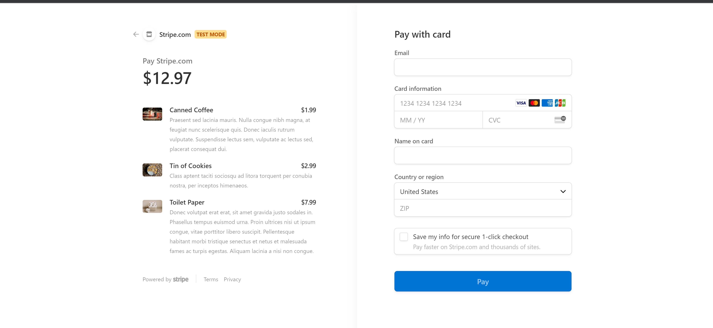

# Redux-Store

## Description

This app is an E-Commerce site that uses the MERN Stack and Stripe. As part of this project I had to refactor the code so that it uses Redux for handling global state instead of Context API. Context API is very similar to Redux in many ways so there wasn't too many changes to implement. In this project I learned the importance of reading the documentation of new techonologies because even though the two, Context API and Redux, are very similar a simmple syntax error can cause a lot of problems.

## Usage

[LIVE SITE](https://mern-shopping-redux-store.herokuapp.com/)

## Technologies

| Technologies Used |
| ----------------- |
| React.js          |
| Redux             |
| JWT               |
| Express.js        |
| Apollo Server          |
| GraphQL           |
| MongoDB           |
| Mongoose          |
| Heroku            |

## License

Copyright (c) [2022] [Kelly R. Cano]

Permission is hereby granted, free of charge, to any person obtaining a copy
of this software and associated documentation files (the "Software"), to deal
in the Software without restriction, including without limitation the rights
to use, copy, modify, merge, publish, distribute, sublicense, and/or sell
copies of the Software, and to permit persons to whom the Software is
furnished to do so, subject to the following conditions:

The above copyright notice and this permission notice shall be included in all
copies or substantial portions of the Software.

THE SOFTWARE IS PROVIDED "AS IS", WITHOUT WARRANTY OF ANY KIND, EXPRESS OR
IMPLIED, INCLUDING BUT NOT LIMITED TO THE WARRANTIES OF MERCHANTABILITY,
FITNESS FOR A PARTICULAR PURPOSE AND NONINFRINGEMENT. IN NO EVENT SHALL THE
AUTHORS OR COPYRIGHT HOLDERS BE LIABLE FOR ANY CLAIM, DAMAGES OR OTHER
LIABILITY, WHETHER IN AN ACTION OF CONTRACT, TORT OR OTHERWISE, ARISING FROM,
OUT OF OR IN CONNECTION WITH THE SOFTWARE OR THE USE OR OTHER DEALINGS IN THE
SOFTWARE.
